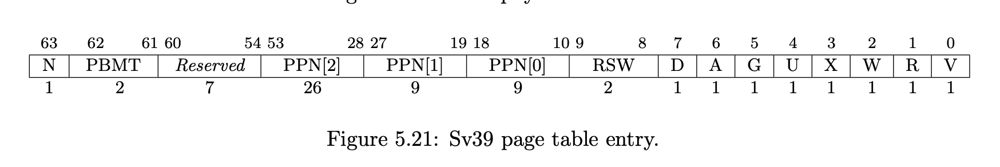

# 简答作业

1.  如图
    
    The V bit indicates whether the PTE is valid; if it is 0, all other bits in the PTE are don’t-cares and may be used freely by software.

    The permission bits, R, W, and X, indicate whether the page is readable, writable, and executable, respectively. When all three are zero, the PTE is a pointer to the next level of the page table; otherwise, it is a leaf PTE. Writable pages must also be marked readable; the contrary combinations are reserved for future use.

    The U bit indicates whether the page is accessible to user mode. U-mode software may only access the page when U=1. If the SUM bit in the sstatus register is set, supervisor mode software may also access pages with U=1. However, supervisor code normally operates with the SUM bit clear, in which case, supervisor code will fault on accesses to user-mode pages. Irrespective of SUM, the supervisor may not execute code on pages with U=1.

    The G bit designates a global mapping. Global mappings are those that exist in all address spaces. For non-leaf PTEs, the global setting implies that all mappings in the subsequent levels of the page table are global. Note that failing to mark a global mapping as global merely reduces performance, whereas marking a non-global mapping as global is a software bug that, after switching to an address space with a different non-global mapping for that address range, can unpredictably result in either mapping being used.

    The RSW field is reserved for use by supervisor software; the implementation shall ignore this field.

    Each leaf PTE contains an accessed (A) and dirty (D) bit. The A bit indicates the virtual page has been read, written, or fetched from since the last time the A bit was cleared. The D bit indicates the virtual page has been written since the last time the D bit was cleared.

2.  - lazy 策略, 比如 COW 实现的 mmap. `stval` 可以记录缺页时对应的地址
    - 好处: 一次性申请 10G 的内存操作系统也不会崩溃
    - 大致占用 $ 10 GB / 4 KB * 8 B = 10 * 2 ^ {20} / 2 ^2 * 8 B= 20 MB $
    - 缺页会发成 Page Fault, 我们需要在 trap_handler 中读取 stval 得到导致缺页的地址, 然后 load 那个地址所在的 page
    - V 变为 0
3.  - 写入 satp 即可
    - 不设置 U 即可
    - 不需要切换页表, 性能好一些
    - 双页表实现下用户程序和内核转换时、用户程序转换时都需要更换页表，而对于单页表操作系统，不同用户线程切换时需要更换页表。

# 报告

实现了一个系统调用, 用于统计当前的 task 的系统调用数量和调度的时间.

# 荣誉准则

1.  在完成本次实验的过程（含此前学习的过程）中，我曾分别与 以下各位 就（与本次实验相关的）以下方面做过交流，还在代码中对应的位置以注释形式记录了具体的交流对象及内容：

无

2.  此外，我也参考了 以下资料 ，还在代码中对应的位置以注释形式记录了具体的参考来源及内容：

无

3.  我独立完成了本次实验除以上方面之外的所有工作，包括代码与文档。 我清楚地知道，从以上方面获得的信息在一定程度上降低了实验难度，可能会影响起评分。

4.  我从未使用过他人的代码，不管是原封不动地复制，还是经过了某些等价转换。 我未曾也不会向他人（含此后各届同学）复制或公开我的实验代码，我有义务妥善保管好它们。 我提交至本实验的评测系统的代码，均无意于破坏或妨碍任何计算机系统的正常运转。 我清楚地知道，以上情况均为本课程纪律所禁止，若违反，对应的实验成绩将按“-100”分计。
